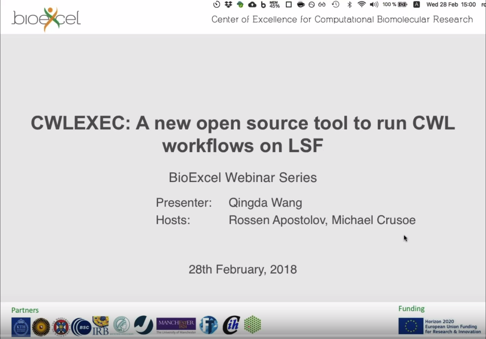
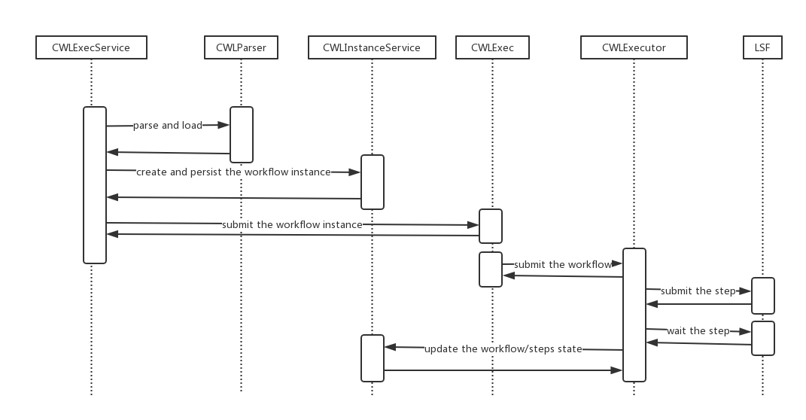
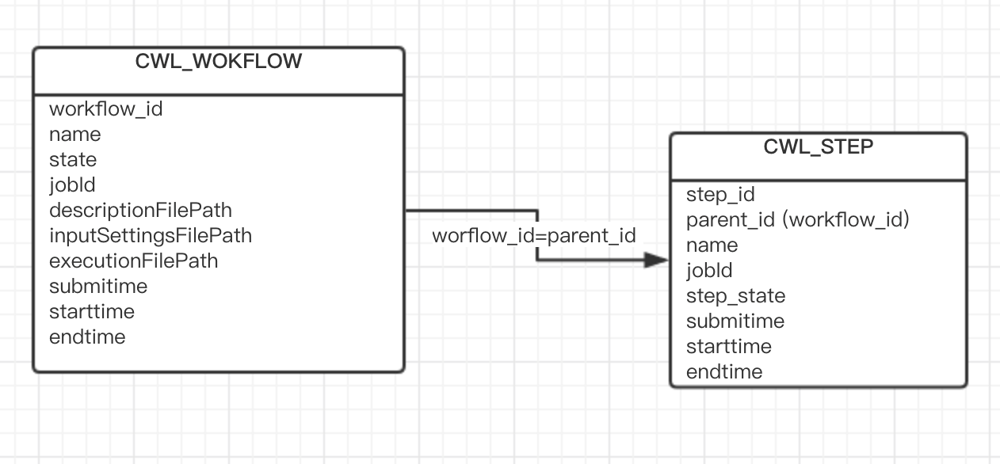

# cwlexec

<a href="https://www.youtube.com/watch?v=_jSTZMWtPAY"></a>

`cwlexec` implements running CWL (Common Workflow Language) workflows on IBM Spectrum LSF. It is written in Java and tested for Java 8, with the following features:

* Tight integration with `IBM® Spectrum LSF`
* Leverages `LSF` features (such as native container support)
* Implements CWL draft-3 and v1.0 with a few exceptions (SoftwareRequirement, ExpressionTool, include directive, remote location in File/Directory specification)


## Install
Installing `cwlexec` is a simple process of downloading and extracting the package.

Before downloading the package, make sure you installed [IBM Spectrum LSF 10.1.0.3](https://www.ibm.com/support/knowledgecenter/en/SSWRJV_10.1.0/lsf_welcome/lsf_welcome.html) (or above) and Java Runtime Environment (version 8), and that you set the `JAVA_HOME` environment variable.

Download the latest release available at https://raw.githubusercontent.com/IBMSpectrumComputing/cwlexec/master/release/cwlexec-0.1.tar.gz and extract the package.

```
tar xzvf cwlexec-0.1.tar.gz
```
Add the extracted directory `cwlexec-0.1` with the `cwlexec` command to the `PATH` environment variable.

## Run
Make sure that you sourced the LSF environment, then run `cwlexec` or `cwlexec -h` to view help.

The following is a typical command to run a CWL workflow:
```
cwlexec [options] workflow-description-location [input-settings-location]
```
## Build
You can build the package from source. Make sure that you have Maven installed

```
git clone https://github.ibm.com/platformcomputing/cwl-engine.git # Clone cwlexec repo
cd cwlexec         # Switch to source directory
mvn package        # build package
```
After the build, the `cwlexec-0.1.tar.gz` package is generated in the `target` directory.


## Test
Conformance test result: 

Total 127 test cases: 
Passed: 107
Unsupported: 19 (`ExpressionTool` is not supported)
Not passed due to limitation: 1 (v1.0/envvar.cwl. LSF does not support propagating the `$HOME` variable)

- Run your conformance tests

[cwltest](https://github.com/common-workflow-language/cwltest) is a CWL testing tool from CWL Specification to run conformance tests.

For instructions on running conformance tests refer to https://github.com/common-workflow-language/common-workflow-language/blob/master/CONFORMANCE_TESTS.md

```
cd cwlexec/src/test/integration-test
./run.sh
```


## Features
`cwlexec` has the following features:

### bsub options support
By default, cwlexec submits steps/jobs without any extra `bsub` options. cwlexec provides a separate configuration file in JSON format to be used for workflow execution `--exec-config|-c`. This enables users to specify LSF-specific options while keeping CWL definitions generic and portable.

```
cwlexec -c myconfig.json myflow.cwl myinput.yml
```

|Field  |Type      |Description    |
|-----  |---    |----------|
|queue	|String		|Specify the LSF queue option `–q <queue>` |
|project|	String|	Specify the LSF project option `–P <project>`|
|rerunnable|	Boolean|		Specify the LSF rerunnable option `-r`|
|app|	String|		Specify the LSF app option `–app <application>`|
|res_req|	String|		Specify the LSF resource option `–R res_req`. Beware that this option will override the `ResourceRequirement` defined. If `res_req` is not specified in exec-config, LSF using following syntax for `ResourceRequirement` specification<br>coresMin:`bsub -n`<br>coresMax:`bsub –n coresMin,coresMax`<br>ramMin:`bsub –R mem>ramMin`<br>ramMax:`bsub –M ramMax`|

The configuration file suppports workflow level and step level settings:

__Workflow setting__: The options in this part are enabled for each workflow step. For example, if a user specifies a queue in this part, cwlexec adds the –q queue_name option for each step/job.

__Step setting__: The options in this part are enabled only for the current step/job. If the current step is a subworkflow, the options are enabled for each step in the subworkflow. 

If the same options appear in the workflow level and step level configuration, the step level setting overrides the workflow level settings.

Examples of execution configuration:

* Specify a queue and enable jobs to be rerunnable for all steps:
```
{
    "queue": "high",
    "rerunnable": true
}
```
* Specify a queue for all steps, specify an application profile for step1, and specify a resource requirement for step2:
```
{
    "queue": "high",
    "steps": {
        "step1": {
            "app": "dockerapp"
        },
        "step2": {
            "res_req": "select[type==X86_64] order[ut] rusage[mem=512MB:swp=1GB:tmp=500GB]"
        }
    }
}
```
* Specify a queue for all steps, enable the rerunnable option, specify resource requirements for mainstep, and specify the application profile for one subworkflow step:
```
{
    "queue": "high",
    "steps": {
        "mainstep": {
            "rerunnable": false,
            "res_req": "select[type==X86_64] order[ut] rusage[mem=512MB:swp=1GB:tmp=500GB]"
        },
        "subflow/step1": {
            "app": "dockerapp"
        }
    }
}
```

### Docker Support
Indicates that a workflow component should be run in a Docker container, and specifies how to fetch or build the image.

Before you start, ensure you configure the following for your environment:
>Docker Engine, Version 1.12, or later, must be installed on an LSF server host. The Docker daemon must be started on this host and can successfully start containers.

cwlexec has two ways to submit docker job in LSF: use the `bsub -app` option to submit a job to a docker application profile, or use `bsub –R <res_req>` to specify a docker 
resource and use "docker run" directly.

__Use Docker application profile to submit job__
The LSF administrator must complete the following configuration steps as a pre-requisite:
* Configure the application in your environment. For more details, refer to  https://www.ibm.com/support/knowledgecenter/en/SSWRJV_10.1.0/lsf_welcome/lsf_kc_docker.html
>Note:
>* Use `$LSB_CONTAINER_IMAGE` in your application configuration; do not hardcode your image. Configure your registry for your image. For example, image(register_server_path/$LSB_CONTAINER_IMAGE)
>* Specify your shell script for preparing Docker variables in CONTAINER, such as (`@/path/dockeroptions.sh`). This location should be in shard directory.
>* If \$LSB_CONTAINER_IMAGE is from Docker-register, configure your register_server_path to your image, such as  image(register_server_path/$LSB_CONTAINER_IMAGE)

* Create your `dockerOptions.sh` with the following content
```
#!/bin/bash
for OPTION in $LSB_CONTAINER_OPTIONS
do
    echo $OPTION
done
```
cwlexec passes volume mappings to the docker job through the `$LSB_CONTAINER_OPTIONS` environment variable, such as workdir, input, output, and \$HOME and envDef defined in EnvVarRequirements. You can add more options in `dockerOptions.sh` as needed, for example
```
…
echo --rm
echo --net=host
echo --ipc=host
…
```

The end user must specify the Docker application profile in `app` in the `exec-config` file, for example
```
app.json
{
    "steps": {
        "step1": {
            "application": "dockerapp"
        }
    }
}
```
Run workflow
```
cwlexec –c app.json docker.cwl docker-job.yml
```

>Note: The docker image must be ready and can be pulled with `docker pull`.

__Specify docker resource to submit job__
The LSF administrator must complete the following configuration steps as pre-conditions:
* Make sure the job submission user is in the `docker` user group.
* If the Docker engine is installed on all LSF server hosts, end users can run Docker jobs without any configuration.
    ```
    cwlexec docker.cwl docker-job.yml
    ```
* If the Docker engine is not installed on all LSF server hosts, define the `docker` boolean resource on hosts that can run Docker jobs. For more details, refer to  
https://www.ibm.com/support/knowledgecenter/en/SSWRJV_10.1.0/lsf_docker/lsf_docker_prepare.html

End users must specify the docker resource in `res_req` in `exec-config` file, for example
```
res.json
{
    "steps": {
        "step1": {
            "res_req": "docker"
        }
    }
}
```

Run workflow
```
./cwlexec –c res.json docker.cwl docker-job.yml
```
>Note: Since the job submission user must be in the docker user group, which is a security concern, use `bsub -app` to submit docker jobs. 

###	Interrupt an executing workflow
You can use `Ctrl+C` to interrupt an executing command. When a command captures this signal, the command exits with 130, and the executing workflow exits. The submitted jobs continue to run, but no new jobs are submitted.

### Rerun a workflow
The workflow exits as long as any step exits. You can rerun the exited workflow with the workflow ID and the workflow is rerun from the failed step.

`cwlexec -r|--rerun  [--debug] <workflow-id>`

When the workflow is rerun if the workflow has running jobs, the command prompts the user to kill the running jobs. 
```
The workflow has running jobs. Do you want to kill them before rerunning the workflow? (Y/N)
```
Choose "Yes" if you want to kill all running jobs before rerunning the workflow. Choose "No" and the command will exit and do nothing.

###	Post-failure script support
You can configure a post-failure script for the workflow. When a step is exited, the post-failure script executes to try to recover the job.

- The post-failure script can be configured at the step or flow level, just like the bsub options in the exec-config configuration file that works at different levels.

- When the script fails (that is, exits with a non-zero code), the exit code of the step will still be the exit code from the job, not the one from the script.

The following environment variables are passed to the post-failure script:

|Variable|Description|
|--------|-----------|
|CWLEXEC_JOB_ID | job ID|
|CWLEXEC_JOB_BSUB | bsub command|
|CWLEXEC_JOB_CMD | job command|
|CWLEXEC_JOB_CWD |job working directory|
|CWLEXEC_JOB_OUTDIR |job output directory|
|CWLEXEC_JOB_RESREQ |job resource requirement|
|CWLEXEC_RETRY_NUM |number of retry time|

The post-failure script:
* Create your post-failure script, for example, /path/recoverscript.sh
```
#!/bin/sh
JOB_ID=$CWLEXEC_JOB_ID
brequeue -aH $JOB_ID
bmod -Z "job command" $JOB_ID
bresume $JOB_ID
```
* Configure the post-failure script in exec_conf, for example, postscript.json
```
{
    ...
    "post-failure-script": {
        "script": "/path/recoverscript.sh"
        "timeout": 10
        "retry": 3
    }
    ...
}
```
Field|Required|Description
---|---|---
Script| Yes| The absolute path of post-failure script
Timeout| No | The timeout of post-failure script. By default 10 seconds
Retry| No| The maximum retry times. By default retry 1 time

* Run your workflow with post-failure script support
```
cwlexec –c postscript.json workflow.cwl workflow-job.yml
```

###	List executed workflows
The `cwlexec --list|-l` command lists all your submitted workflows information, and the `cwlexec --list|-l <workflow-id>` command displays a workflow information in detail.


|Field	|Description|	
|---|---|
|ID	|	The unique identifier for this workflow|
|Name		|The name of workflow|
|Submit Time|		The time that the workflow is submitted	|
|Start Time	|	The time that the workflow is started to execute|
|End Time	|The time that the workflow is finished|
|Exit State		|The workflow exit state, DONE or EXITED|
|Exit Code		|0~255|
|Working Directory	|The workflow work directory	|
|Output Directory		|The workflow output directory	|
|CWL File|		The path for workflow description file	|
|Input Setting Files|	The path for workflow input settings file|

### Exit Code Definition
If all steps of the workflow are done and the workflow is successful, the workflow exit code is 0. By default, if a workflow step exit code is 0 and its outputs match the output schema, the step was treated as done; otherwise the step is treated as exited.

If a user defines the success code for a workflow step, the step exit code is in the successCodes, and its outputs match the output schema, the step is treated as done; otherwise the step is treated as exited.

If any step exits in a workflow, the workflow exits and the command exit code will be the exit code of the exited step. If the workflow exits, all submitted jobs continue to run, but no new jobs are submitted.


|Exit Code|Description|
|-------   |---|
|0	    |The workflow is done|
|33|	There is an unsupported feature in the workflow|
|130	|User used Ctrl + C to interupt the workflow|
|250|	The workflow version is unsupported|
|251|	Fail to parse workflow|
|252|	Fail to load workflow inputs|
|253|	Fail to evaluate the expression in workflow|
|254|	Fail to capture the workflow/step output after the workflow/step is done|
|255|	System exception. For example, command arguments are wrong; the CWL workflow description file cannot be found; bsub/bwait command cannot be found|

## Implementation
Overview on how `cwlexec` is implemented

### Overview

cwlexec includes three packages:
- com.ibm.spectrumcomputing.cwl.model: defines the Java beans for CWL document
- com.ibm.spectrumcomputing.cwl.parser: parses CWL document to a Java object and binds the input settings to the parsed object
- com.ibm.spectrumcomputing.cwl.exec: executes the workflow



### Working Directory

The workflow work directory is used to store intermediate files of the workflow execution. It must be a shared directory for the LSF cluster. 

Each workflow work directory is under the user specified `-w` work directory top. By default the top directory is `$HOME/cwl-workdir`, it is organized as the following:
```
WORKDIR_TOP
  |-workflow_id
      |- inputs
      |- ...
      |- step_id
      |    |- inputs
      |    |- ...
      |    |- output_id
      |    |- ...
      |- ...
  |- ...
```
The workflow id is a global unique id (UUID)

### Record the workflow execution states

Each workflow information and execution states will be recorded to an embedded database `HyperSQL`. For each cwlexec command user, the embedded database records are persisted to `$HOME/.cwlexec`

There are two tables that are used to persist the workflow records


### Workflow Execution

The execution sequence of a CWL workflow is as follows:

1. Parse the CWL document to yield a Java object and resolve the dependencies for each step.
2. Load the input settings and bind them for parsed object (if needed).
3. Evaluate the parsed object expressions.
4. Traverse the parsed object and submit the all of workflow steps.
    * If the step is a CommandLineTool, there are three types:
        I. Independent step: Build the step command by step inputs and arguments first, then submit (`bsub`) the step with the command. Set the step to running, record the LSF job ID, and send a start event (include the step job id) to its main workflow.
        II. A step that has dependencies and the dependencies are from the main workflow inputs: Build the step command by step inputs, arguments and dependent main workflow inputs first, then submit (`bsub`) the step with the command. Set the step to running, record the LSF job ID, and send a start event (include the step job id) to its main workflow.
        III. A step that has dependencies and the dependencies are from other workflow steps outputs: Create a placeholder execution script (a shell script with blank content) for this step first, then submit (`bsub -H`) the step with the placeholder execution script. Set the step to waiting and record the LSF job ID.
    - If the step is a subworkflow, repeat the previous step.
    - If the step is a scatter, create a placeholder script (exit 0) for it, then submit this step (`bsub -H`). Set the step to waiting and record the LSF job ID. After the scatter is done, change the step state to done and send a start event to its main workflow, then resume (`bresume`) this step.
5. After the main workflow receives the step start event, it broadcasts the event to its waiting steps. When a step receives the start event, it checks its dependencies. If all the dependencies are ready (all dependencies corresponding start events are received), wait (`bwait -w`) for the ready dependencies. After the wait action is met, this step validates the dependencies' outputs. If all outputs are validated, build the command for this step by the outputs and fill the command to the corresponding placeholder script. The step then sends a done event for all of the dependencies' steps to its main workflow and this step is resumed (`bresume`). Finally, set this step to running and send a start event to its main workflow.
6. After the main workflow receives the step done event, the workflow counts the done steps. If all steps in the workflow are done, the workflow itself is done.
7. If any wait (`bwait`) action is failed, the step sends an exit event (include the exit step job ID) to its main workflow.
8. If any output validation is failed, the step sends an exit event (include the exit step job ID) to its main workflow.
9. After the main workflow receives the step exit event, the workflow is exited, and all of waiting steps are killed (`bkill`), but running jobs will continue to run.

## Community Contribution Requirement
Community contributions to this repository must follow the [IBM Developer's Certificate of Origin (DCO)](https://github.ibm.com/platformcomputing/cwl-engine/blob/master/IBMDCO.md) process, and only through GitHub Pull Requests:

 1. Contributor proposes new code to the community.

 2. Contributor signs off on contributions
    (that is, attaches the DCO to ensure contributor is either the code
    originator or has rights to publish. The template of the DCO is included in this package).

 3. IBM Spectrum LSF Development reviews the contribution to check for:
    i)  Applicability and relevancy of functional content
    ii) Any obvious issues

 4. If accepted, the contribution is posted. If rejected, work goes back to the contributor and is not merged.
